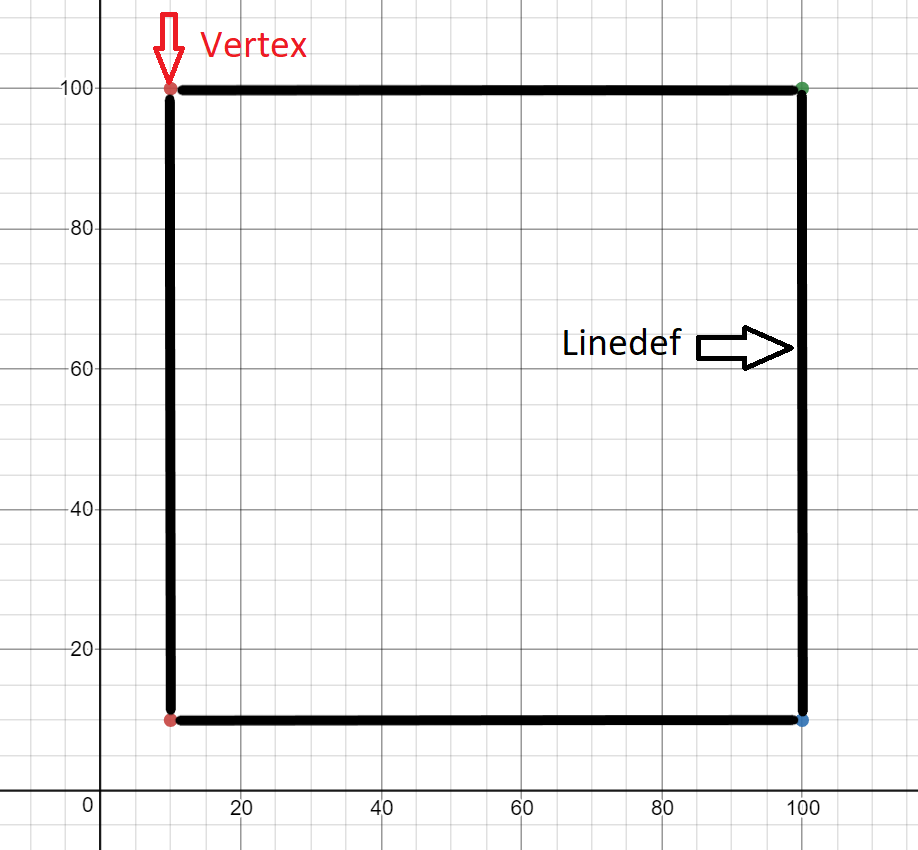
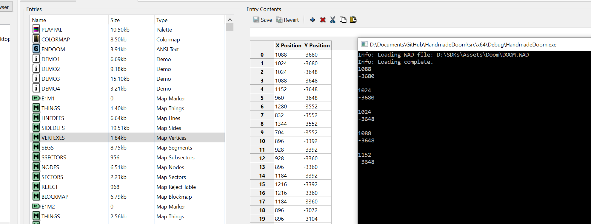
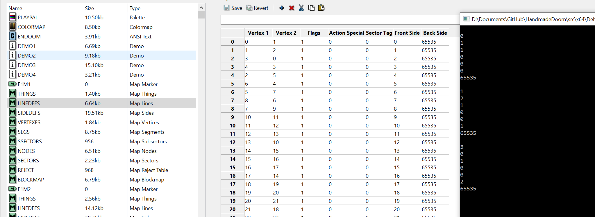
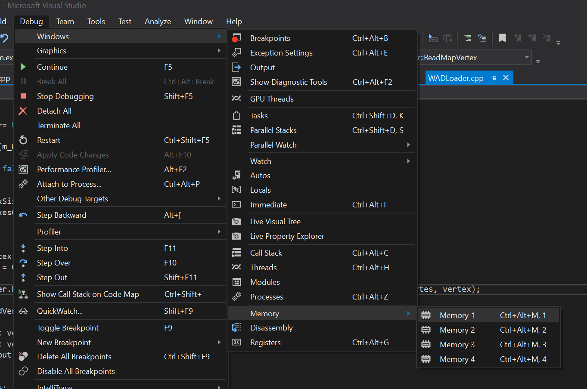
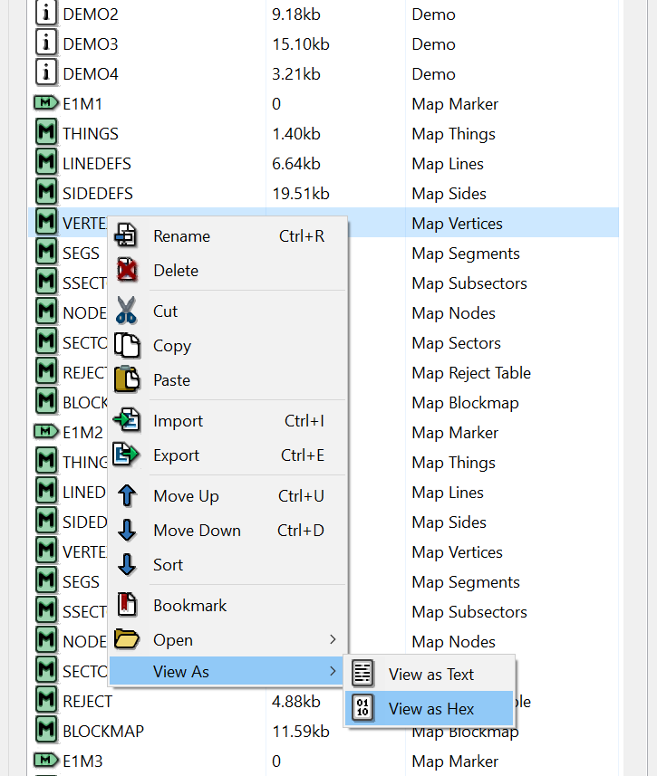
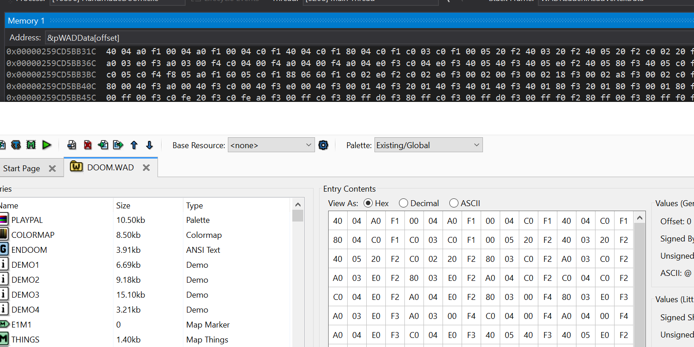
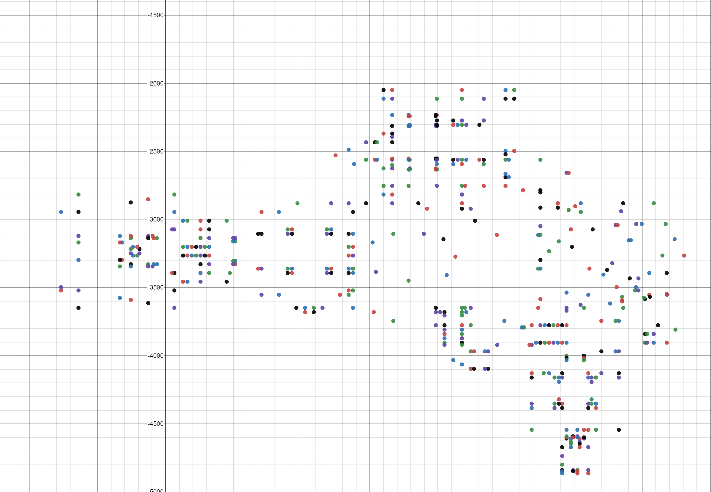
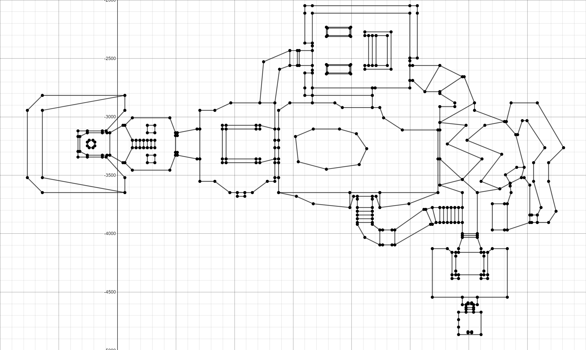

Reviewers:
*  Marl [@DOOMReboot](https://twitter.com/DOOMReboot)  

# Notes 002 - Basic Map Data
Now that we can read a WAD file, let’s try to make use of the data we read. Maybe it would be nice to see if we can read any of the Mission (world/level) data and if we could put it to some use. The Mission Lumps can be somewhat complex and tricky. So, we will have to go step by step to build our knowledge and confidence. So, as our first small step let’s build something like the Automap feature. If you are not aware of what is an automap it is a bird's eye, 2D view of the map. For now, let’s see what is inside the Mission Lump.  
  
## Map Anatomy  
First things first, DOOM missions are represented very similarly to a 2D blueprint with lines representing the walls.  However, each wall takes the heights of the floor and ceiling in order to have 3D coordinates (XY is the plane you on which you move around horizontally, while Z is the height which allows you to move up and down when performing actions such as riding a lift or jumping down from a platform.  These three components of a coordinate are used to render the Mission as a 3D world.  However, the engine has certain constraints such as no overlapping rooms and the inability to look up and down. Another interesting fact to consider is that the player's projectiles, such as the rocket, will rise vertically to hit a target which is on a higher platform.  

These curiosities have been the cause of innumerable casualties in the holy war fought over whether DOOM is a 2D or 3D engine.  A diplomatic compromise was reached, and many lives were saved when the description of DOOM being "2.5D" was found to be mutually acceptable.

To simplify our task and to bring us back on topic, let’s try to just read that 2D data and see if we could put it to use. We will soon attempt to render it in 3D when we become a bit more familiar with it and how the individual pieces fit together.
  
With some investigation, each Mission is composed of a set of Lumps. Those Lumps always show in the same sequence within the original DOOM WAD.
1. **VERTEXES:** Are the endpoints of a wall in 2D. Two connected VERTEXES form one LINEDEF.  Three connected VERTEXES form two walls/LINEDEFS, and so on and so forth. Just think about it as a meeting point of two or more walls. (Yes, most people prefer the term "Vertices". Both are perfectly acceptable according to [merriam-webster](https://www.merriam-webster.com/dictionary/vertexes).
2. **LINEDEFS:** These are the lines forming the connections between VERTEXES, forming walls. Not all lines (walls) behave the same, there is flags that define the behavior of those lines.  
3. **SIDEDDEFS:** In real life there is two sides of a wall, the one you are facing, and the one on the other side. Those two sides of the wall could have different textures, SIDEDEFS is a lump which holds the texture information for a wall (LINEDEF).  
4. **SECTORS:** SECTORs are the "rooms" created by connecting LINEDEFs together.  Each sector contains information such as the floor and ceiling heights and textures, and light value, special actions such as moving floors/platforms/elevators.  Some of these settings will also affect how walls are rendered such as the light level and calculation of texture mapping coordinates.
5. **SSECTORS:** SSECTORS (subsectors) form convex areas within a sector which are used to aid in rendering and in tandem with traversal of the BSP which also aids in determining exactly where the player is within a level.  This is quite useful and a very common usage of this is to determine the vertical position of the player.  Each SSECTOR consists of connected fractions of a sector, such as the walls that make up a corner.   
6. **SEGS:** Segs are fractions of a wall/LINEDEF; to put it another way, they are "segments" of a wall/LINEDEF.  The world is rendered by traversing a BSP tree in order to determine which walls to draw first, closest first. These SEGs are then used to render walls rather than the LINEDEFs themselves.  Each SSECTOR's geometry is defined by the segs which it contains.  
7. **NODES:** BSP node, it is a binary tree node structure that stores the sub-sector data.  It is used to quickly determine which sector the player is in. Eliminating SEGs which are not in player view, and therefore cannot be seen, allows the engine to instead focus on potentially visible SEGs which dramatically speeds up rendering time.
8. **THINGS:** The THINGS Lump is a list of the Mission's decorations and actors (enemies, weapons, etc.).  Each entry in the lump provides information for one instance of an actor/decoration and provides information such as type of object, spawn point, direction they are to face and so forth.
9. **REJECT:** This lump contains data about which sectors are visible from which other sectors.  It is utilized to determine when a monster can become aware of the player's presence.  It also is used to define how far noises, such as a gunshot, created by the player will travel.  A monster can then become alerted when such a sound is able to flood through into the monster's sector.  The REJECT table can also be used to quicken collision detection of projectile weapons.
10. **BLOCKMAP:** Collision-detection information for player and THING movement.  It consists of a grid which encompasses the entire Mission geometry.  Each cell within the grid contains a list of LINEDEFs that are inside or cross through it. This is used to dramatically speed up collision detection since collision tests will only need to be run against a few LINEDEFs per player/THING which produces a significant computation savings.
  
What we will focus on to generate our 2D map would be VERTEXES and LINEDEFS. If we can plot the vertexes and connect those vertexes with the lines defined by linedefs, then we should be able to generate a 2D representation of the map.  

  

The above demo map has the following characteristics 
* 4 Vertexes
  * vertex 1 at (10,10)
  * vertex 2 at (10,100)
  * vertex 3 at (100, 10)
  * vertex 4 at (100,100)
  
* 4 lines
  * line from vertex 1 to 2
  * line from vertex 1 to 3
  * line from vertex 2 to 4
  * line from vertex 3 to 4

### Vertex Format
The vertexes data is simple as you would expect, just the x, and y (a point), on some coordinates.
  
| Field Size | Data Type    | Content    |  
|------------|--------------|------------| 
|  0x00-0x01 | Signed short | X Position |
|  0x02-0x03 | Signed short | Y Position |
  
### Linedef Format
Linedef seems to have more information in it, it shows a line that connect two vertexes, and properties to that line (which later will be a wall).
  
| Field Size | Data Type      | Content                                   |  
|------------|----------------|-------------------------------------------| 
|  0x00-0x01 | Unsigned short | Start vertex                              |
|  0x02-0x03 | Unsigned short | End vertex                                |
|  0x04-0x05 | Unsigned short | Flags (details below)                     |
|  0x06-0x07 | Unsigned short | Line type / Action                        |
|  0x08-0x09 | Unsigned short | Sector tag                                |
|  0x10-0x11 | Unsigned short | Right sidedef ( 0xFFFF side not present ) |
|  0x12-0x13 | Unsigned short | Left sidedef  ( 0xFFFF side not present ) |
  
### Linedef Flags Values
Note all lines (walls) are to be drawn. Some have special behaviors.  
  
| Bit | Description                                          |
|-----|------------------------------------------------------|
|  0  | Blocks players and monsters                          |
|  1  | Blocks monsters                                      |
|  2  | Two sided                                            |
|  3  | Upper texture is unpegged (will research this later) |
|  4  | Lower texture is unpegged (will research this later) |
|  5  | Secret (shows as one-sided on automap)               |
|  6  | Blocks sound                                         |
|  7  | Never shows on automap                               |
|  8  | Always shows on automap                              |
  
## Goals
1. Create a Map class.  
2. Read vertex data.  
3. Read linedef data.  
  
## Design
First, let’s create a class and call it map, where we will store all the map related data.  
For now, I have plans to just store the vertexes and linedefs in a vector, so we would try to put them to some use later.  
Let’s also update WADLoader and WADReader to help us achieve reading this two new information.
  
## Coding
Coding this should be like what we did on Notes 001, just add few more structures then populate them with the data from the WAD.   
Starting by adding a new class and will be passing the name of the map.  
  
``` cpp
class Map
{
public:
    Map(std::string sName);
    ~Map();

    std::string GetName(); // Incase someone need to know the map name
    void AddVertex(Vertex &v); // Wrapper class to append to the vertexes vector
    void AddLinedef(Linedef &l); // Wrapper class to append to the linedef vector

protected:
    std::string m_sName;
    std::vector<Vertex> m_Vertexes;
    std::vector<Linedef> m_Linedef;
};
```
  
Now let’s add structs so we would can read those new fields. Since we have already done this a few times, let’s add both at once this time.  
  
``` cpp
struct Vertex
{
    int16_t XPosition;
    int16_t YPosition;
};
  
struct Linedef
{
    uint16_t StartVertex;
    uint16_t EndVertex;
    uint16_t Flags;
    uint16_t LineType;
    uint16_t SectorTag;
    uint16_t RightSidedef;
    uint16_t LeftSidedef;
};
```
  
Now we will need a function to read those from the WADReader, this is close to what we did the other day.  
  
``` cpp
void WADReader::ReadVertexData(const uint8_t *pWADData, int offset, Vertex &vertex)
{
    vertex.XPosition = Read2Bytes(pWADData, offset);
    vertex.YPosition = Read2Bytes(pWADData, offset + 2);
}
  
void WADReader::ReadLinedefData(const uint8_t *pWADData, int offset, Linedef &linedef)
{
    linedef.StartVertex = Read2Bytes(pWADData, offset); 
    linedef.EndVertex = Read2Bytes(pWADData, offset + 2);
    linedef.Flags = Read2Bytes(pWADData, offset + 4);
    linedef.LineType = Read2Bytes(pWADData, offset + 6);
    linedef.SectorTag = Read2Bytes(pWADData, offset + 8);
    linedef.RightSidedef = Read2Bytes(pWADData, offset + 10);
    linedef.LeftSidedef = Read2Bytes(pWADData, offset + 12);
}
```
  
I don't think there is anything new up to this point, and as you guessed by now, we need to call those functions from the WADLoader class!

Let me state some facts, the sequence of the lumps does matter, we will find the map name in the directory lump, then all maps related lumps will follow in the given order. To makes things easier for us and not to keep track of lumps index individually I have added an enum to avoid magic numbers.
  
``` cpp
enum EMAPLUMPSINDEX
{
    eTHINGS = 1,
    eLINEDEFS,
    eSIDEDDEFS,
    eVERTEXES,
    eSEAGS,
    eSSECTORS,
    eNODES,
    eSECTORS,
    eREJECT,
    eBLOCKMAP,
    eCOUNT
};
```
  
Also, I will be adding a function to find the map in by name in the directory list. We will likely improve performance for this later by using a map data structure instead as there are a significant number of entries and we will have to iterate through them quite frequently, particularly when we start loading media such as textures, sprites, sounds, and so forth.
  
``` cpp
int WADLoader::FindMapIndex(Map &map)
{
    for (int i = 0; i < m_WADDirectories.size(); ++i)
    {
        if (m_WADDirectories[i].LumpName == map.GetName())
        {
            return i;
        }
    }

    return -1;
}
```
  
Wow we are almost done! let’s just read the VERTEXES now! Again, we have done the same thing before! You are a pro by now!
  
``` cpp
bool WADLoader::ReadMapVertex(Map &map)
{
    int iMapIndex = FindMapIndex(map);

    if (iMapIndex == -1)
    {
        return false;
    }

    iMapIndex += EMAPLUMPSINDEX::eVERTEXES;

    if (strcmp(m_WADDirectories[iMapIndex].LumpName, "VERTEXES") != 0)
    {
        return false;
    }

    int iVertexSizeInBytes = sizeof(Vertex);
    int iVertexesCount = m_WADDirectories[iMapIndex].LumpSize / iVertexSizeInBytes;

    

    Vertex vertex;
    for (int i = 0; i < iVertexesCount; ++i)
    {
        m_Reader.ReadVertexData(m_WADData, m_WADDirectories[iMapIndex].LumpOffset + i * iVertexSizeInBytes, vertex);

        map.AddVertex(vertex);

        cout << vertex.XPosition << endl;
        cout << vertex.YPosition << endl;
        std::cout << std::endl;
    }

    return true;
}
``` 
  
Hmm, this feels like just copy pasting code over and over, maybe we need to optimize this sometime later, but for now you will be implementing ReadMapLinedef yourself (or look at provided source code).
  
Final touches, we need to call this function passing a map object to it.
  
``` cpp
bool WADLoader::LoadMapData(Map &map)
{
    if (!ReadMapVertex(map))
    {
        cout << "Error: Failed to load map vertex data MAP: " << map.GetName() << endl;
        return false;
    }

        if (!ReadMapLinedef(map))
    {
        cout << "Error: Failed to load map linedef data MAP: " << map.GetName() << endl;
        return false;
    }
    return true;
}
```
  
Now let’s update the main function and see if things run, oh I want to load the Map "E1M1" which I will pass in the to the map object.
  
``` cpp
    Map map("E1M1");
    wadloader.LoadMapData(map);
```
  
Now let’s run this! Wow! lots of cool number, but are they correct? Let’s check!  
let’s see if slade can help us here again.
  
We can locate the map in the slade menu and look at the lump’s details, let’s compare numbers.
  
  
Looks good!
What about the Linedef?
  
  
I have also added this enum mostly we will try to utilize this when we try to draw the map.

``` cpp
enum ELINEDEFFLAGS
{
    eBLOCKING      = 0,
    eBLOCKMONSTERS = 1,
    eTWOSIDED      = 2,
    eDONTPEGTOP    = 4,
    eDONTPEGBOTTOM = 8,
    eSECRET        = 16,
    eSOUNDBLOCK    = 32,
    eDONTDRAW      = 64,
    eDRAW          = 128
};
```

## Other Notes
While I was writing this code, I mistakenly was reading more bytes than I should have, and I was getting wrong values. To debug this, I started looking at the WAD offset in memory to see if I'm at the correct offset. This can be accomplished by visual studio memory windows which I find a very handy tool when it comes to byte or memory tracing (you can also place break point in that window).  
  
If you don’t see the memory window to go Debug > Memory > Memory.  
  
  
  
Now you can see the memory values in hexadecimal.  
Those values can be compared by the hex view in slade, where you can right click any lump and view it as hex.  
  
  
  
Comparing both with the address of the WAD that is loaded in memory  
  
  

One final thing for today, we have seen all those vertexes numbers, is there an easy way to plot those without writing the code, I don’t want to invest time then find out we were not working in the right direction.  
For sure someone out there implemented graph plotter. Surely, I googled "draw points on a graph" and first result was a website called [Plot Points - Desmos](https://www.desmos.com/calculator), you can paste from your clipboard with multiple points and it should draw them for you. We will need to format as flowing "(x, y)". That is easy just let’s change our print function to do that for us.  

``` cpp
cout << "("  << vertex.XPosition << "," << vertex.YPosition << ")" << endl;
```
  
Wow! That is a resemblance of E1M1! We are up to something!  
  
 

If your lazy to do that here is a link with the vertex being populated  

[Plot Vertex](https://www.desmos.com/calculator/jatccysan2)

But let’s step it up, with a little bit of work we can connect those points given the linedefs.  

 

Here is a link

[E1M1 Plot Vertex](https://www.desmos.com/calculator/3mle5kuzsi)  

## Source code
[Source code](../src)    

## Reference
[Doom Wiki](https://doomwiki.org/wiki/WAD)  
[ZDoom Wiki](https://zdoom.org/wiki/WAD)  
 
