Reviewers:
*  Marl [@DOOMReboot](https://twitter.com/DOOMReboot)  

# Notes 010 - Player FOV
At this point we are traversing all the segs in the map, but we don't care about most of them. We only care about the ones within the player's FOV. FOV (Field of View) are the angles in which game objects are visible for the player, anything outside that angle won't be visible (and we don't have to render it).  

Here is the FOV for the player as he spawns in E1M1, the player spawns facing 90 degrees.  

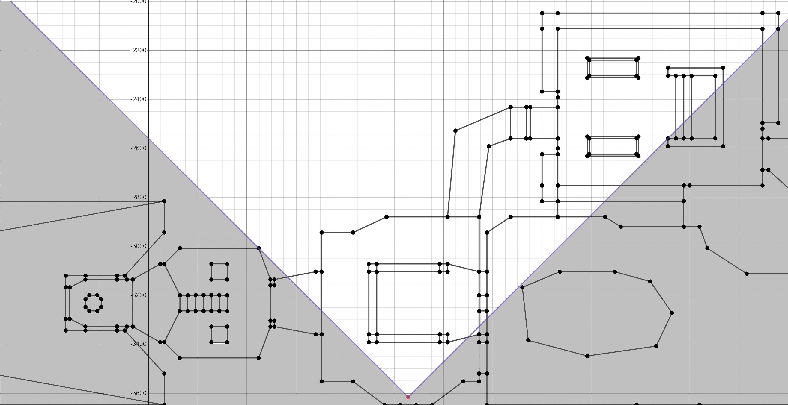 

For now, we will only care about horizontal FOV.   
Doomguy has a 90-degree FOV so we will stick to that.  
Our previous code was able to iterate though Segs, we colored all of them, now we want to filter them down and the only color the ones that are both within our FOV and facing the player.  

There will be a lot of details, so I will try to keep the explanation in the code section, so we don't get lost. Before we go any further, I would like to mention that Doom uses BAM (binary angular measurement), a 360-degree angle system which increases counterclockwise. To handle that we will write a class to store the angle in a similar way.  

Finding if a seg in the FOV could be summarized by finding the angle of the seg relative to the player position and calculate if it is in the player's FOV angle.  

## Goals
1. Create a class to handle 360 angles.  
2. Add a function to calculate the angle between the player and vertex.  
3. Add a function to determine if a seg is in the player's FOV and clip it if needed.  
4. Add the ability for the player to rotate using arrow keys (left and right).  
5. Color only Segs in the player's FOV.  
   
## Coding
Our first goal should be easy to implement, most of it is doing the mathematical operations on floating point angles then calling ```Normalize360``` to make sure the angle stays within a range of 360 degrees.  

``` cpp
class Angle
{
public:
    Angle();
    Angle(float angle);
    ~Angle();

    Angle operator=(const float& rhs);
    Angle operator+(const Angle& rhs);
    Angle operator-(const Angle& rhs);
    Angle operator-();
    Angle& operator+=(const float& rhs);
    Angle& operator-=(const float& rhs);

    bool operator<(const Angle& rhs);
    bool operator<(const float& rhs);
    bool operator<=(const Angle& rhs);
    bool operator<=(const float& rhs);
    bool operator>(const Angle& rhs);
    bool operator>(const float& rhs);
    bool operator>=(const Angle& rhs);
    bool operator>=(const float& rhs);

    float GetValue();

protected:
    float m_Angle;

    void Normalize360();
};
```

The only important function to discuss is ```Normalize360```. It makes sure we are in the 360 range (0 to 359, inclusive).  

``` cpp
void Angle::Normalize360()
{
    m_Angle = fmodf(m_Angle, 360);
    if (m_Angle < 0)
        m_Angle += 360;
}
```

Calling fmodf will wrap around an angle if its value is more than 360 and the if condition checks and handles if it becomes a negative value. After doing any operation on the m_Angle variable just call ``` Normalize360 ```.  

Now, we have a class that can handle 360 degrees. Let's move to the next goal, finding the angle to a point relative to where the player is. This is a simple trigonometry problem. 
Let's have an example and see how we could solve this problem.  

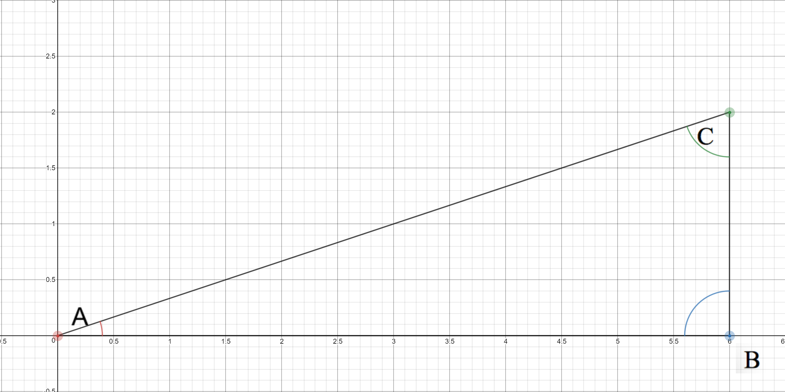  

Given:  
*  Assume player is at Point A (0, 0).
*  We need to find the angle to point C (which is point 6, 2 relative to player position).
*  All we need to find is angle A.

We can use atan to solve this

```
tan(angle A) =  Side BC / Side AB
tan(angle A) = 2 / 6
tan(angle A) = 0.33333333333
Angle A = atan(0.33333333333)
Angle A = 0.321750 rad (or 18.4349 degrees)
```

In other words, if we know the change in X and the change in Y relative to the player position, we should be able to find out the angle using tangent.  
Conversion from radians to degrees is multiplying by 180 and dividing by PI (3.14159...).  
Now putting this all into code

``` cpp
Angle Player::AngleToVertex(Vertex &vertex)
{
    float Vdx = vertex.XPosition - m_XPosition;
    float Vdy = vertex.YPosition - m_YPosition;

    Angle VertexAngle(atan2f(Vdy, Vdx) * 180 / PI) ;

    return VertexAngle;
}
```

I have used ```atan2f ``` because it will correctly handle the points in all four quadrants, the angle class we created should take care of normalizing the angle correctly.  

Now, let's move to the more complicated goal, finding if a seg is in the player FOV.  
It turns out that there are multiple ways to achieve this, but I will stick to how things were done by the original DOOM engine (I find it is the simplest to implement).  
There are a few cases to handle here, but first thing we need to check is if the Seg is facing the player. 
A Seg has two vertices, V1 and V2, and the order of the points tells us where it is facing, so if the angle to V1 is greater than the angle of V2 it is facing us, otherwise, it will be less than 180 degrees.  

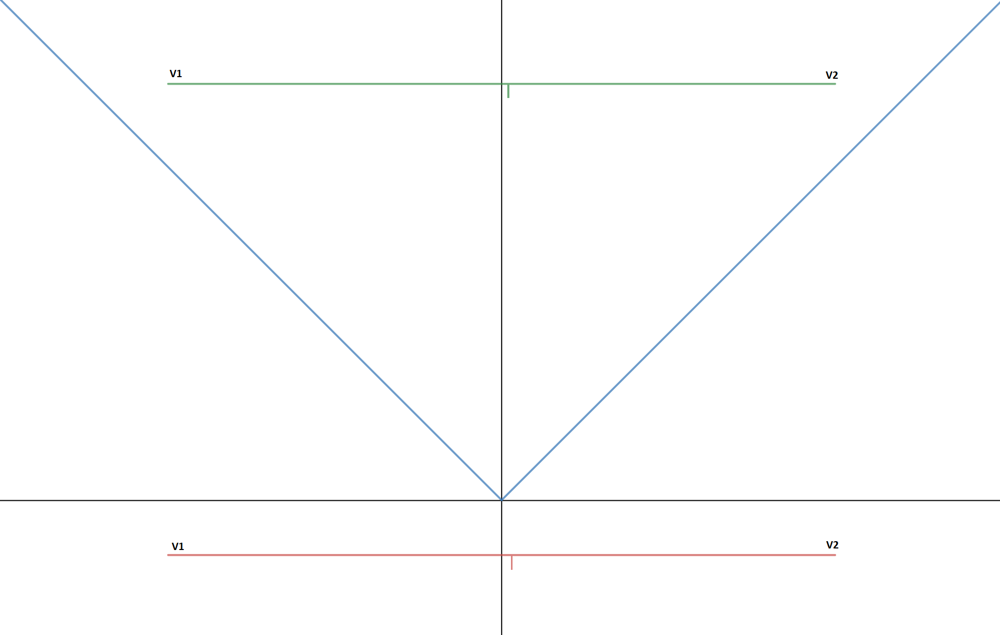  

Notice the green line above (which is facing the player). The angle to V1 is greater than the V2 angle.  
Once you move the same line behind the player orange line angle to V2 > V1 angle.  
We can use this property to detect if a line is facing a player or not.
We can also reject a line we are standing on (exactly 180), at the end the player is looking forward and not at his feet.

``` cpp
Angle V1dxAngle = AngleToVertex(V1);
Angle V2dxAngle = AngleToVertex(V2);

Angle V1ToV2Span = V1dxAngle - V2dxAngle;

if (V1ToV2Span >= 180)
{
    return false;
}
```

To have an idea of where Linedefs are facing in E1M1 have a look at 

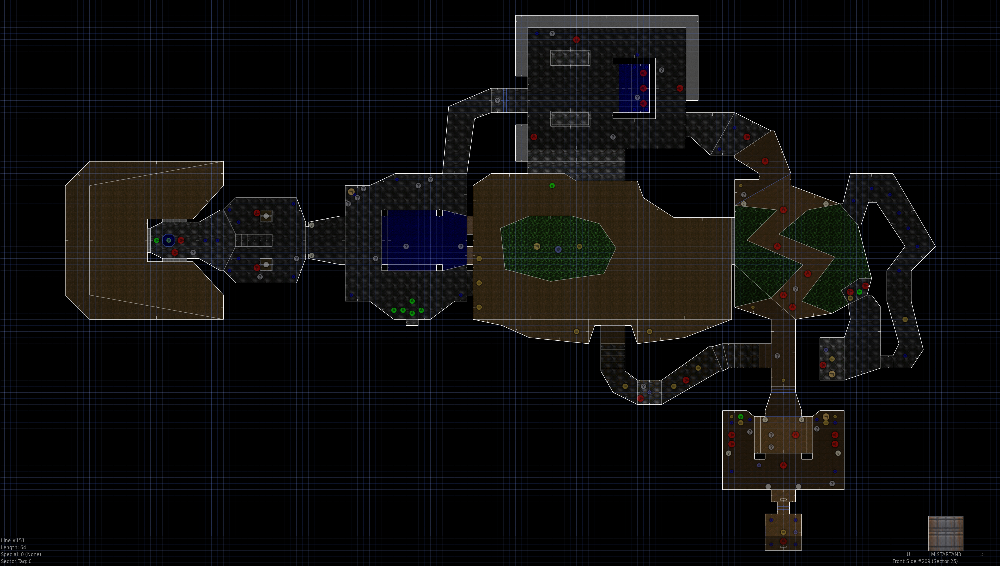  

The small line in the middle of the Linedefs indicates where it is facing.  

Given:  
*  FOV = 90
*  Player angle splits the FOV into two parts (+45, -45)

Now, let's have a look at the cases that need clipping. Up to this point, we know that the Segs are facing us (V1 is always bigger than V2 and the angle between them less than 180). There are five special cases to handle, let's have a look at those cases.

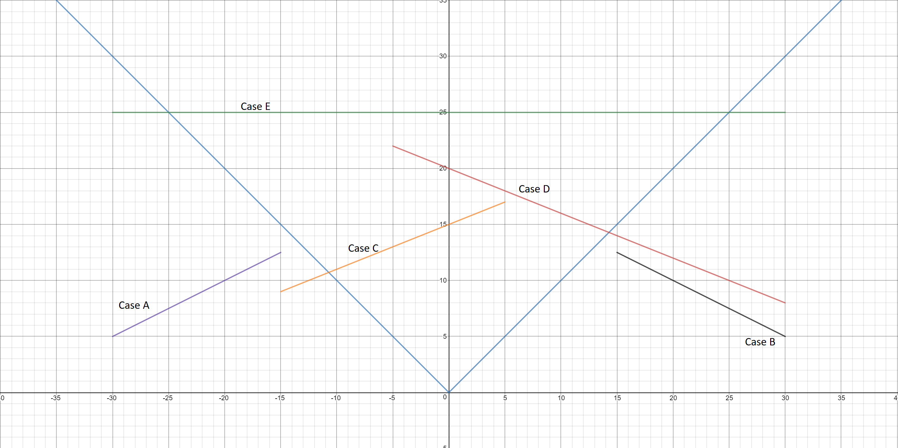  

Assuming the player is looking at 90 degrees making the FOV between 45 to 135 degrees.
* Case A: The Seg is all the way to the left of the player FOV (not visible).
* Case B: The Seg is all the way to the right of the player FOV (not visible).
* Case C: The right part of the Seg visible to the player (Partially visible, clipping left).
* Case D: The left part of the Seg is partially visible to the player (Partially visible, clipping right).
* Case E: Part of the Seg is visible (Partially visible, clipping both left and right).

Turn's out that there is a simple way to solve this, all we need to do is some simplification to handle all these cases efficiently.  

The player could be looking anywhere, so we need to move everything into a specific quadrant.  
We will move the walls to always rotate as if everything is around 0 degrees, by subtracting the player angle.

``` cpp
    // Rotate everything.
    V1Angle = V1Angle - m_Angle;
    V2Angle = V2Angle - m_Angle;
```

So, the above example will look like this after the rotations  

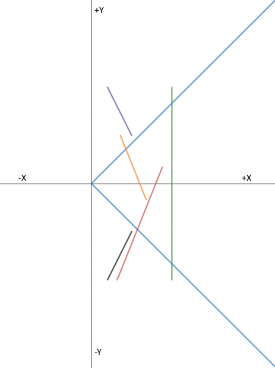  

So, now the center of the player view is 0 degrees. The left side of the FOV is at 45 degrees, and the right side will be at 315 degrees (or -45).
Let's work on V1 first. We want to check if V1 is inside the FOV or outside. We can do one more small change to make this even easier, we can add half of the FOV (45 degrees) to make the player look exactly at 45 degrees. Then we can check if V1 is more than FOV (90 degrees).  

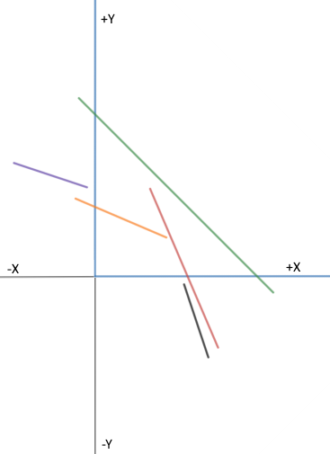  

If V1 is more than FOV, then it is outside the FOV.

``` cpp	
Angle V1Moved = V1Angle + HalfFOV;
if (V1Moved > m_FOV)
{
    // We are sure now that V1 is outside the FOV!
    // We need to check if angle "cone" of V1 to V2 is also outside the FOV?
    
    ...

    // V2 is Valid.
    // We need to clip the V1
    V1Angle = HalfFOV;
}
```

How can we check if the angle "Cone" of V1 to V2 is outside the FOV? We can find out by a comparing how far V1 is away from the FOV, if that distance is more than the V1 to V2 angle then this line is completely outside the FOV.  

``` cpp
Angle V1MovedAngle = V1Moved - m_FOV;

// Are both V1 and V2 outside?
if (V1MovedAngle >= V1ToV2Span)
{
    return false;
}
```

Up to this point we have handled the following cases: A, B, we have clipped C, and we have clipped part of Case E!  
We still need to handle the right side of E and D.  

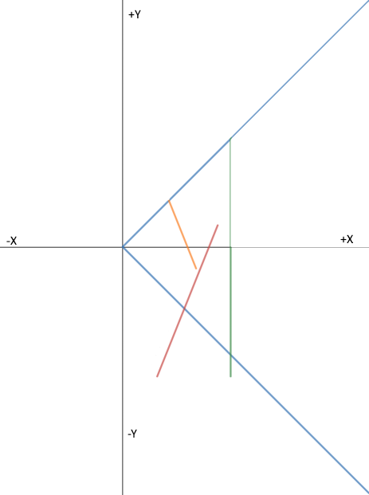  

Using the same logic, it should be easy to evaluate V2! But, there is a problem! You could add the half FOV to V2, and anything less than zero is outside!  
Hmmm... that won't work! There is no angle less than 0! As soon as you go under zero you wraparound to 359! So, it will always be bigger than zero!  We must subtract the left side of the FOV (45 degrees) and see if that angle is greater than FOV. If so, then we need to clip it.  

``` cpp
Angle V2Moved = HalfFOV - V2Angle;

// Is V2 outside the FOV?
if (V2Moved > m_FOV)
{
    V2Angle = -HalfFOV;
}
```
Now we have clipped V2 if needed!

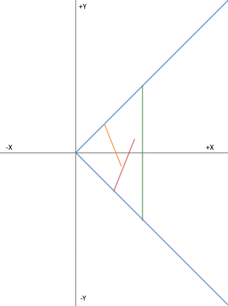

The final case is both V1 and V2 is in FOV. There's nothing special about that case, we just proceed.  

Here is the function in one piece!

``` CPP
bool Player::ClipVertexesInFOV(Vertex &V1, Vertex &V2, Angle &V1Angle, Angle &V2Angle)
{
    V1Angle = AngleToVertex(V1);
    V2Angle = AngleToVertex(V2);

    Angle V1ToV2Span = V1Angle - V2Angle;

    if (V1ToV2Span >= 180)
    {
        return false;
    }

    // Rotate everything.
    V1Angle = V1Angle - m_Angle;
    V2Angle = V2Angle - m_Angle;

    Angle HalfFOV = m_FOV / 2;

    // Validate and Clip V1
    // shift angles to be between 0 and 90 (now virtually we shifted FOV to be in that range)
    Angle V1Moved = V1Angle + HalfFOV;

    if (V1Moved > m_FOV)
    {
        // now we know that V1, is outside the left side of the FOV
        // But we need to check is Also V2 is outside.
        // Let's find out what is the size of the angle outside the FOV
        Angle V1MovedAngle = V1Moved - m_FOV;

        // Are both V1 and V2 outside?
        if (V1MovedAngle >= V1ToV2Span)
        {
            return false;
        }

        // At this point V2 or part of the line should be in the FOV.
        // We need to clip the V1
        V1Angle = HalfFOV;
    }

    // Validate and Clip V2
    Angle V2Moved = HalfFOV - V2Angle;

    // Is V2 outside the FOV?
    if (V2Moved > m_FOV)
    {
        V2Angle = -HalfFOV;
    }

    V1Angle += 90;
    V2Angle += 90;

    return true;
}
``` 

One final note about this function is that what we clipped is the angle, and not the Seg itself.  

If you have difficulties, the best thing to do is visualize what is going on. For example, here are the first Segs we process (index 76). Which are composed of five Segs that follow  

 
| V1            | V2            |  
|---------------|---------------|  
| (1152, -3648) | (1088, -3648) |  
| (1024, -3648) | (960, -3648)  |  
| (1280, -3552) | (1152, -3648) |  
| (960,-3648)   | (832, -3552)  |  
| (1088, -3648) | (1024,-3648)  |  

Player spawn's at (1056, -3616), with a 90-degree FOV. Visualizing this on a graph we have

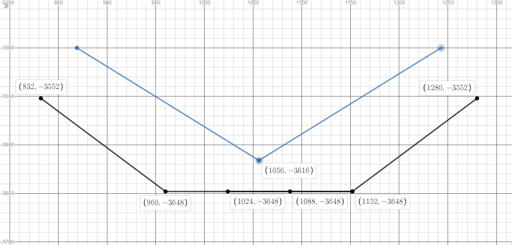  

By looking at the above layout we can tell that they are all outside of the FOV of the player!  

You can also use [this map](https://www.desmos.com/calculator/v9iatx3r6q).  

Let's update the code to make the player rotate! It is as simple as incrementing the player's angle!  
The value 0.1875 is just a number I came up with!  

``` cpp
void Player::RotateLeft()
{
    m_Angle += (0.1875f * m_iRotationSpeed);
}

void Player::RotateRight()
{
    m_Angle -= (0.1875f * m_iRotationSpeed);
}
```

Now, let's call the player's rotation function when the keys are pressed!

``` cpp
case SDLK_LEFT:
    m_pPlayer->RotateLeft();
    break;

case SDLK_RIGHT:
    m_pPlayer->RotateRight();
    break;
```

Now, you can run the code and rotate the player left and right.  
This method of reading keyboard input is not optimal, when using SDL events, we are under the mercy of Windows' keyboard polling rate. With this method you will notice that the controls behave more like typing and not like reading the key status every frame. I find this nice for debugging and I was able to catch bugs using this technique.

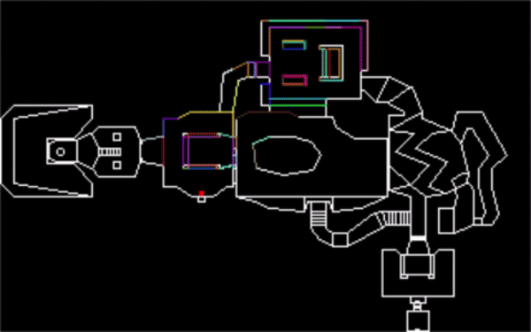  


So, let's summarize what we have done.
At this point we can traverse through all the Segs, from near to far, then we are able to determine which ones are actually in the player's FOV. What we need to do next is determine where those sigs would be drawn on the screen. This will be our next step. 

## Other Notes
The code we have covered today is a part of the R_AddLine function, if you understand what happened today it should be more or less the same.  
``` cpp
void R_AddLine (seg_t*	line)
{
    int			x1;
    int			x2;
    angle_t		angle1;
    angle_t		angle2;
    angle_t		span;
    angle_t		tspan;
    
    curline = line;

    // OPTIMIZE: quickly reject orthogonal back sides.
    angle1 = R_PointToAngle (line->v1->x, line->v1->y);
    angle2 = R_PointToAngle (line->v2->x, line->v2->y);
    
    // Clip to view edges.
    // OPTIMIZE: make constant out of 2*clipangle (FIELDOFVIEW).
    span = angle1 - angle2;
    
    // Left side? I.e. backface culling?
    if (span >= ANG180)
	return;		

    // Global angle needed by segcalc.
    rw_angle1 = angle1;
    angle1 -= viewangle;
    angle2 -= viewangle;
	
    tspan = angle1 + clipangle;
    if (tspan > 2*clipangle)
    {
	tspan -= 2*clipangle;

	// Totally off the left edge?
	if (tspan >= span)
	    return;
	
	angle1 = clipangle;
    }
    tspan = clipangle - angle2;
    if (tspan > 2*clipangle)
    {
	tspan -= 2*clipangle;

	// Totally off the left edge?
	if (tspan >= span)
	    return;	
	angle2 = -clipangle;
    }
    
    // The seg is in the view range,
    // but not necessarily visible.
    angle1 = (angle1+ANG90)>>ANGLETOFINESHIFT;
    angle2 = (angle2+ANG90)>>ANGLETOFINESHIFT;

    ...
    ...
    ...
    ...
}
```

## Source code
[Source code](../src)  

## Reference
[Wiki BAM](https://en.wikipedia.org/wiki/Binary_scaling#Binary_angles)  
