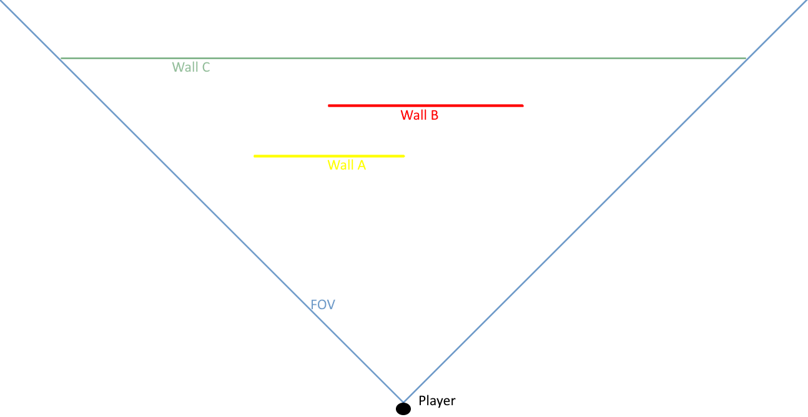
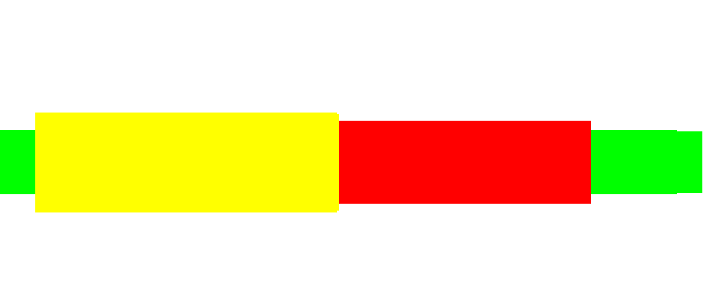
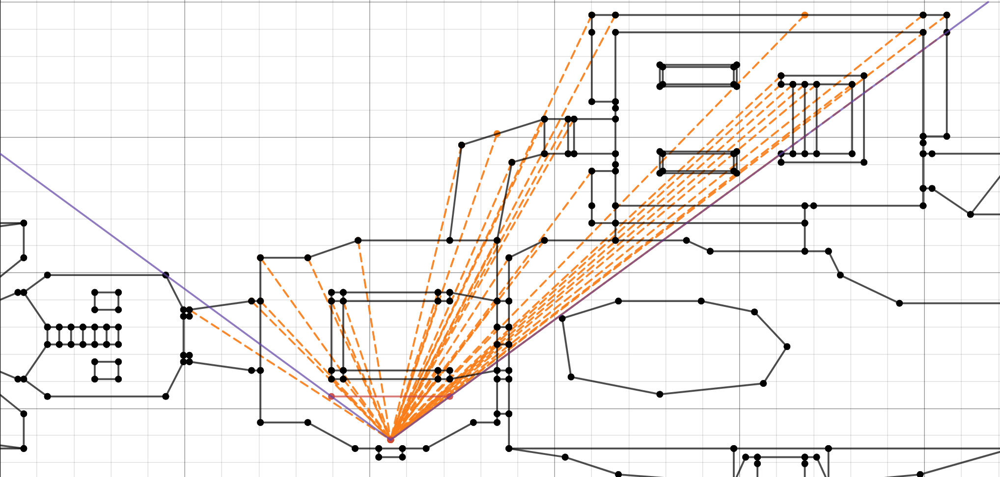
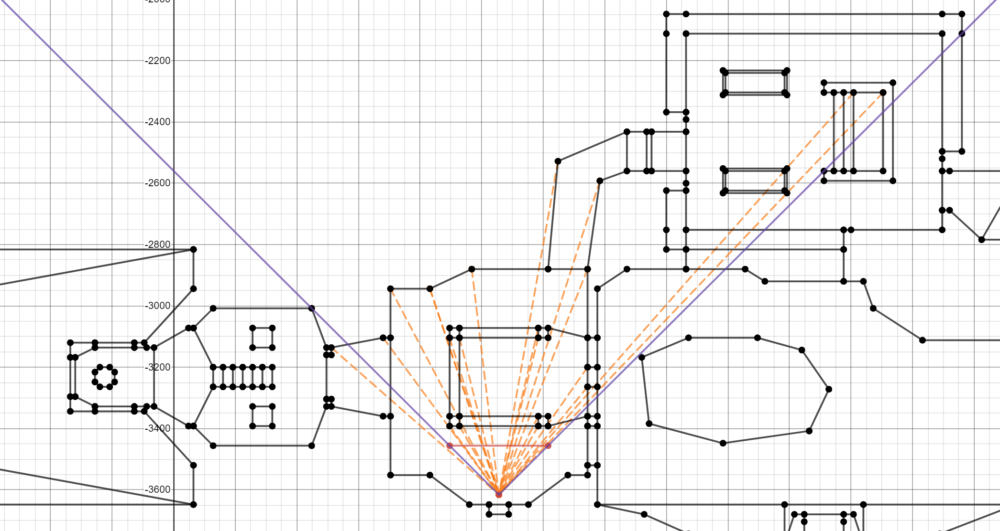
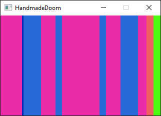
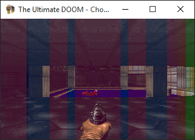
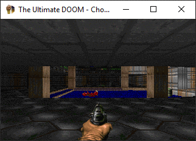

Reviewers:
*  Marl [@DOOMReboot](https://twitter.com/DOOMReboot)  

# Notes 013 - Clipping Solid Walls  
Things are heating up; we are getting closer and closer to rendering the 3D view! I can see the excitement in your eyes!   
Without further do, let's get started.   
As usual, let's recap what is going on. Up to this point we are able to iterate though the walls in the field of view, and we have filtered only the solid walls. But not all of those are visible, a solid wall will block you from seeing another wall behind it.  

For example, look at this top view.  

  

You would expect that the player would see something like this  

  

(Note: this is not a very accurate example, but please buy it! Those walls have no depth)  

See how the red wall is clipped by the yellow wall in front of it?
We need to figure out which wall clips which wall, and that is what we will do today.   

Chocolate / Classic Doom has a nice implementation. A good overview about how this algorithm works can be found in Game Engine Black book DOOM 1.1ed (section 5.12.3.3). I would recommend reading it.  

Before we jump to the implementation, the simplest possible way to do this would be to have an array that matches the size of the screen's width. Let's say array of 320 bool elements, and every time you get a Segment you know its starting and ending X position, with a simple for loop you can check if it is already occupied by some other wall (if not update it). Although this method is used elsewhere in DOOM code, it is not used for wall clipping.  

Let's start with an overview of how the Chocolate/Classic Doom algorithm works. At this point we are iterating though the Segs near-to-far, so if a wall fills an area on screen, no other wall can fill same area later.  
So what we should do is to just keep track of where the Segs are drawn on screen, and if a previous wall already occupied that spot, then the Seg might be clipped or not drawn at all! sounds simple? 
Let's visualize how this works    

  

In the above animation each vertical colored rectangle represents a wall. Once it fills an area no other rectangles at a later stage is drawn over it.  
If you have a keen eye, this is the view you'll see as soon as Doomguy spawns in E1M1. You can easily see the pillars getting drawn (in blue) first, didn't I say we are getting really close? :)

## Goals
* Clip solid walls.
* Generate color for same texture
* Draw visible solid walls

## Coding
About the clipping solid walls algorithm, it works by keeping track of the start and end of contiguous X coordinate filled areas on the screen instead of having an individual boolean for each X coordinate.  
The key to this algorithm is keeping the elements sorted and handling special cases correctly.  
Here is a summary of the cases we need to handle  
*  The Seg is not clipped by another solid wall, it is all visible. (Insert)
*  The Seg is completely clipped by another wall. (Ignore the new Seg)
*  Part of the Seg is clipped (Update a current entry in the linked list)
*  The Seg is partially visible, but multiple walls are clipping it (Update and Delete other entries).

Given:
* For each Seg we have two edges, V1 and V2.
* V1 and V2 are converted to screen coordinates V1XScreen and V1XScreen
* V1XScreen < V2XScreen is always true
* V1XScreen is the start of the edge
* V2XScreen is the end of the edge

A simple struct for storing the range and keeping them sorted in a linked list

``` cpp 
struct SolidSegmentRange
{
    int XStart;
    int XEnd;
};
```

This simple struct will keep track of a filled area on the screen.  

``` cpp
std::list<SolidSegmentRange> m_SolidWallRanges;
```

Those segments will be updated, merged, deleted, and inserted in a linked list. The linked list will keep track of all the segments that are drawn on the screen. AGAIN, we need to keep things sorted in the linked list! 

Lets go step by step!
An empty list would have two dummy entries, negative infinity and positive infinity! The algorithm completes if negative infinity and positive infinity Segments merge together. Within an int there is no negative or positive infinity, so we will use INT_MIN and INT_MAX.

So, our linked list gets initialized in InitFrame function with those values

``` cpp
void ViewRenderer::InitFrame()
{
    SetDrawColor(0, 0, 0);
    SDL_RenderClear(m_pRenderer);

    m_SolidWallRanges.clear();

    SolidSegmentRange WallLeftSide;
    SolidSegmentRange WallRightSide;

    WallLeftSide.XStart = INT_MIN;
    WallLeftSide.XEnd = -1;
    m_SolidWallRanges.push_back(WallLeftSide);

    WallRightSide.XStart = m_iRenderXSize;
    WallRightSide.XEnd = INT_MAX;
    m_SolidWallRanges.push_back(WallRightSide);
}
```

Making the linked list look something like this

```
[0] INT_MIN, -1  
[1] 320, INT_MIN
```

Notice how the struct at index zero just ends at -1, and how the other starts at 320. Both are just one pixel outside screen.  

This algorithm can be broken down into two main cases:
* Inserting or Updating to the left of an existing entry in the linked list.
* Updating or Deleting to right of an existing entry in the linked list.

Let's say our first Seg to track starts at 69 and ends at 80 (which we will call CurrentWall), what we need to do next is to search if that range is occupied in list.  
To achieve this we look into each entry in the linked list. Since we know that the list is always sorted, we linearly search for where the correct position's (CurrentWall) start edge to end edge is within the linked list entries.  

``` cpp
    std::list<SolidSegmentRange>::iterator FoundClipWall = m_SolidWallRanges.begin();
    while (FoundClipWall != m_SolidWallRanges.end() && FoundClipWall->XEnd < CurrentWall.XStart - 1)
    {
        ++FoundClipWall;
    }
```

First, let's handle the scenarios where the Update or Insert is to the left of the FoundClipWall.

We need to check if it is a new entry in the list or if we should update one edge of the existing FoundClipWall

``` cpp
 if (CurrentWall.XStart < FoundClipWall->XStart)
    {
        // Are the they overlapping?
        if (CurrentWall.XEnd < FoundClipWall->XStart - 1)
        {
            //All of the wall is visible, so insert it
            StoreWallRange(seg, CurrentWall.XStart, CurrentWall.XEnd);
            m_SolidWallRanges.insert(FoundClipWall, CurrentWall);
            return;
        }

        // The end is already included, just update start
        StoreWallRange(seg, CurrentWall.XStart, FoundClipWall->XStart - 1);
        FoundClipWall->XStart = CurrentWall.XStart;
    }

```
Note: StoreWallRange function just does the drawing and is not storing anything for now.  
Our new values will be inserted, updating the list to look like 

```
[0] INT_MIN, -1  
[1] 68, 80
[2] 320, INT_MIN
```

Now, let's try to add 46, 69
The implementation will update the list to look like this (no new entry will be added)

```
[0] INT_MIN, -1  
[1] 46, 80
[2] 320, INT_MIN
```

Now, let's try to add a new seg, starting at 70 and ends 75.  
It will fail the above checks so we will need to add a check to see if it is completely clipped

``` cpp
    // This part is already occupied
    if (CurrentWall.XEnd <= FoundClipWall->XEnd)
        return;
```

We have handled the left side of the FoundClipWall, and at this point we know CurrentWall is to the right of FoundClipWall. But, will it span over multiple elements or will updating the right side of the FoundClipWall be enough?

Let's take the case where it is spanning over multiple elements to the right; let's assume the linked list now looks like this
```
[0]	INT_MIN,  -1
[1]	46, 80
[2]	107, 195
[3]	198, 210
[4]	223, 291
[5]	320, INT_MAX
```
and we are processing a Seg with start at 76 and end at 107. This will require us to close the gap between element at index 1 and index 2.
To do that we will Update the element at index one and Delete the element at index 2.

``` cpp
    // Start looking and next entry in the linked list
    std::list<SolidSegmentRange>::iterator NextWall = FoundClipWall;

    // Is the next entry within the CurrentWall range?
    while (CurrentWall.XEnd >= next(NextWall, 1)->XStart - 1)
    {
        // partialy clipped by other walls, store each fragment
        StoreWallRange(seg, NextWall->XEnd + 1, next(NextWall, 1)->XStart - 1);
        ++NextWall;

        if (CurrentWall.XEnd <= NextWall->XEnd)
        {
            FoundClipWall->XEnd = NextWall->XEnd;
            // Do we need to remove entries from the linked list?
            if (NextWall != FoundClipWall)
            {
                //Delete a range of walls
                FoundClipWall++;
                NextWall++;
                m_SolidWallRanges.erase(FoundClipWall, NextWall);
            }
            return;
        }
    }
```

Note: In this case we just had to delete one element, there are cases where more than one element will be deleted.

Finally, the last check is to handle an edge case, for example the linked list is as following

```
[0]	INT_MIN, -1
[1]	46, 210
[2]	223, 291
[3]	320, INT_MAX
```
and the new Seg starts at 0 and ends at 42, this will fail the above cases, so we need to handle it separately.

``` cpp
    StoreWallRange(seg, NextWall->XEnd + 1, CurrentWall.XEnd);
    FoundClipWall->XEnd = CurrentWall.XEnd;

    // Yes this edge case could also span over multiple elements
    if (NextWall != FoundClipWall)
    {
        FoundClipWall++;
        NextWall++;
        m_SolidWallRanges.erase(FoundClipWall, NextWall);
    }
```

updating the linked list to  

```
[0]	INT_MIN, 42
[1]	46, 210
[2]	223, 291
[3]	320, INT_MAX
```

As more and more walls fill the screen, the more elements will merge, up to a point where all of the screen if filled. A single entry will remain in the list 

```
[0]	INT_MIN, INT_MAX
```

Here is the algorithm all in one piece

``` cpp
void ViewRenderer::ClipSolidWalls(Seg &seg, int V1XScreen, int V2XScreen)
{
    // Find clip window 
    SolidSegmentRange CurrentWall = { V1XScreen, V2XScreen };

    std::list<SolidSegmentRange>::iterator FoundClipWall = m_SolidWallRanges.begin();
    while (FoundClipWall != m_SolidWallRanges.end() && FoundClipWall->XEnd < CurrentWall.XStart - 1)
    {
        ++FoundClipWall;
    }

    if (CurrentWall.XStart < FoundClipWall->XStart)
    {
        // Are the edges touching?
        if (CurrentWall.XEnd < FoundClipWall->XStart - 1)
        {
            //All of the wall is visible, so insert it
            StoreWallRange(seg, CurrentWall.XStart, CurrentWall.XEnd);
            m_SolidWallRanges.insert(FoundClipWall, CurrentWall);
            return;
        }

        // The end is already included, just update start
        StoreWallRange(seg, CurrentWall.XStart, FoundClipWall->XStart - 1);
        FoundClipWall->XStart = CurrentWall.XStart;
    }

    // This part is already occupied
    if (CurrentWall.XEnd <= FoundClipWall->XEnd)
        return;

    std::list<SolidSegmentRange>::iterator NextWall = FoundClipWall;

    while (CurrentWall.XEnd >= next(NextWall, 1)->XStart - 1)
    {
        // partially clipped by other walls, store each fragment
        StoreWallRange(seg, NextWall->XEnd + 1, next(NextWall, 1)->XStart - 1);
        ++NextWall;

        if (CurrentWall.XEnd <= NextWall->XEnd)
        {
            FoundClipWall->XEnd = NextWall->XEnd;
            if (NextWall != FoundClipWall)
            {
                //Delete a range of walls
                FoundClipWall++;
                NextWall++;
                m_SolidWallRanges.erase(FoundClipWall, NextWall);
            }
            return;
        }
    }

    StoreWallRange(seg, NextWall->XEnd + 1, CurrentWall.XEnd);
    FoundClipWall->XEnd = CurrentWall.XEnd;

    if (NextWall != FoundClipWall)
    {
        FoundClipWall++;
        NextWall++;
        m_SolidWallRanges.erase(FoundClipWall, NextWall);
    }
}
```

Note: I have rewritten this algorithm multiple times due to bugs (tricky edge cases!); the algorithm might look simple but handling all the cases correctly is difficult!

As promised in previous notes, I need to get rid of all those flickering colors.
To make things look more authentic we can use the texture name as a key for the random color. This means that surfaces with same texture will have same color, making it easier on the eyes and giving the world a more coherent look.

``` cpp
SDL_Color ViewRenderer::GetWallColor(std::string textureName)
{
    if (m_WallColor.count(textureName))
    {
        return m_WallColor[textureName];
    }
    else
    {
        SDL_Color color{ rand() % 255, rand() % 255, rand() % 255 };
        m_WallColor[textureName] = color;
        return color;
    }
}
```

Don't forget to draw the walls!

``` cpp
void ViewRenderer::DrawSolidWall(SolidSegmentData &visibleSeg)
{
    SDL_Color color = GetWallColor(visibleSeg.seg.pLinedef->pRightSidedef->MiddleTexture);
    // We know nothing about the wall hight yet, so draw from top of the screen to the bottom
    SDL_Rect Rect = { visibleSeg.XStart, 0, visibleSeg.XEnd - visibleSeg.XStart + 1, m_iRenderYSize };
    SetDrawColor(color.r, color.g, color.b);
    SDL_RenderFillRect(m_pRenderer, &Rect);
}
```

Now, this was all the solid walls


After clipping it should be something like



Now run!  


What a masterpiece!  
...  
...  
What? ....   

So, it doesn't look like walls to you? You don't trust me? Hmm... honestly, I don't trust software engineers myself, so I don't blame you! Let me try to prove it!
So, the original screen should be something like this


If we overlay those screens you will see this



Morphing them together  



Do you believe me now? Yes, I know there is still some work to be done! But, we have achieved some really good progress.  
Now, what we need to do next is to draw the walls with the correct height.  

## Other Notes
The solid wall clipping is an interesting algorithm, there was a very minimal use of memory, also keeping the list short with merging keeps the sequential search fast.
What we have discussed is a common interview question, you can read more here [Merge Intervals](https://leetcode.com/problems/merge-intervals/).
The implemented algorithm was hard to get bug free in the first try; I have gone though four or five iterations before getting it right.  

The algorithm exists in Chocolate DOOM under the name ```R_ClipSolidWallSegment```. It might look more complex, but in reality, they are both the same. Ours just looks more simple because we are using the built in C++ STD List. Meanwhile, the original code had to shift elements up the array when deleting entries.  
One interesting thing I found was that the function ```R_ClipPassWallSegment``` is more or less the same as ```R_ClipSolidWallSegment```, few ``if`` statements and both functions would been merged, but we will talk about ```R_ClipPassWallSegment``` in detail in an upcoming notes.  

## Source code
[Source code](../src)  

## Reference
[Chocolate Doom](https://www.chocolate-doom.org/wiki/index.php/Chocolate_Doom)
