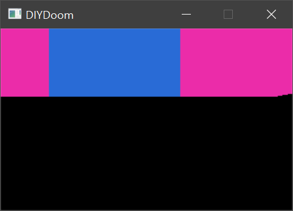
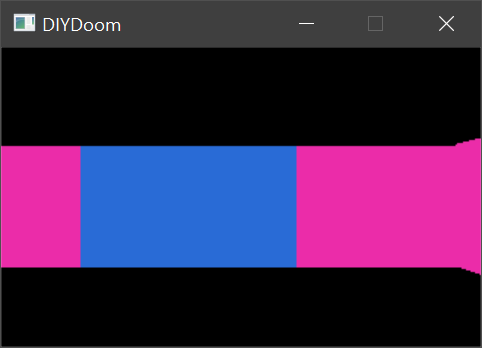

Reviewers:
*  Marl [@DOOMReboot](https://twitter.com/DOOMReboot)  

# Notes 017 - Player Height
Up to this point we are able render both solid and portal segs, here is a visualization of the rendering in slow motion.  

  

If you spent some time navigating the map you would have noticed that the player doesn't go up or down steps or stairs, and it is kind of annoying. We did implement a fly and sink last notes, but I would love to see the player just go upstairs and downstairs (with minimal animation). In E1M1 we are lucky that the player spawns on a floor with 0 height, if you switch to E1M3 you will see that when the player spawns the walls are halfway above his head.  



## Goals
* Refactoring / Cleanup  
* Find the correct player eye-level height
* Set player eye level based on sector height  

## Code
Implementing player height calculation, was much easier that I expected, if you have gone thought Notes 006, 007, 008 you will find this a piece of cake.  

Remember the part where you search for the sector the player is in? Once you find the sector, find out its height and add the player eye level to it.  

So simple implement the search of player exactly like what we have done previously  

``` cpp
int Map::GetPlayerSubSectorHieght()
{
    int iSubsectorID = m_Nodes.size() - 1;
    while (!(iSubsectorID & SUBSECTORIDENTIFIER))
    {

        bool isOnLeft = IsPointOnLeftSide(m_pPlayer->GetXPosition(), m_pPlayer->GetYPosition(), iSubsectorID);

        if (isOnLeft)
        {
            iSubsectorID = m_Nodes[iSubsectorID].LeftChildID;
        }
        else
        {
            iSubsectorID = m_Nodes[iSubsectorID].RightChildID;
        }
    }
    Subsector &subsector = m_Subsector[iSubsectorID & (~SUBSECTORIDENTIFIER)];
    Seg &seg = m_Segs[subsector.FirstSegID];
    return seg.pRightSector->FloorHeight;
    
}
```

Once you found the sector return the floor height, this is where the player is standing! now all you must do is simply add the player eye level to that height (which is 41 in DOOM)  

``` cpp
void Player::Think(int iSubSectorHieght)
{
    m_ZPosition = iSubSectorHieght + m_EyeLevel;
}
```

Now the best place to call those functions is when the DoomEngine is updating!  

``` cpp
void DoomEngine::Update()
{
    m_pPlayer->Think(m_pMap->GetPlayerSubSectorHieght());
}

```

Now play  

  

Even switching to E1M3 now or other maps you will be standing on the floor  
a look at E1M3  

  

Next, I will start exploring how we could read the textures from the WAD files and see if we could possibly give the walls some texture. 

## Other Notes
Update: Originally this notes was titled "History", I have rolled back those code change and updated the notes. I just found it is better to stick to what was implemented in DOOM, and not to cause confusion at later notes. You can go back in git history and check the old version.

Now looking at my code, it is very obvious that the design is missed up, there is allot of stuff happening in ViewRenderer class, we should have a separate class to handle a segment and draw it (similar to DOOM code), also having the player as a separate class is not a good idea. I see that we should have a Things class, then the player should be sub-class. All things will need to know its sector height, they will also need to move around.  

## Source code
[Source code](../src)  

## Reference
[Chocolate DOOM](https://github.com/chocolate-doom/chocolate-doom)
